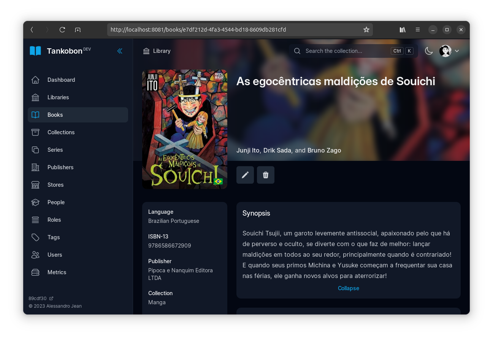

# Tankobon

Tankobon is a free and open source physical book collection manager,
created with [Kotlin], [Spring Boot] and [Vue.js].

<p align="center">
  <picture style="width: 90%">
    <source media="(prefers-color-scheme: dark)" srcset="./.github/images/book-demo-img-dark.png">
    <source media="(prefers-color-scheme: light)" srcset="./.github/images/book-demo-img-light.png">
    
  </picture>
</p>

> **Warning**
> Tankobon is under active development and is an ongoing **WIP**.
> Anyone is welcome to try it out, but do not expect a fully featured,
> bug-free experience. Some features will be missing and/or broken.
> It's not recommended to be used in production yet. Stay tuned
> for any news and future stable releases.

[Kotlin]: https://kotlinlang.org/
[Spring Boot]: https://spring.io/
[Vue.js]: https://vuejs.org/

## Features

The following items are the major features aimed to be added to
Tankobon on the initial releases.

- Generic book support, including manga and comics;
- Import books by ISBN from Open Library, Google Books™ and others;
- Publishers, people, stores, groups and other related entities;
- Multiple users, shared libraries and administration tools;
- Cover search by ISBN, code or book title;
- Book readings history tracking;
- Search with advanced query syntax;
- Upload custom covers and pictures;
- Monthly statistics of expense.

The project is open to suggestions and ideas, so feel free
to reach out if you have anything you'd like to see.

## Download

Get the tool from our [releases page] or through Docker.

[releases page]: https://github.com/alessandrojean/tankobon

## Getting started

Tankobon isn't ready for normal usage yet. For now, follow the [Contributing]
section to build from source and run locally.

[Contributing]: #contributing

## Contributing

Contributions are very **welcome**! Please review the [CONTRIBUTING.md]
guide before getting started.

A quick summary of the steps required to get going:

1. Install [pnpm], [Node.js] and [JDK 17].
2. Run the server:
   
   ```console
   $ ./gradlew bootRun --args='--spring.profiles.active=dev,localdb'
   ```
3. Run the client:

   ```console
   $ pnpm dev
   ```

And that's it! Open [http://localhost:8081](http://localhost:8081) in a browser
and follow the claim setup at the first time to create the administrator user.

[pnpm]: https://pnpm.io/
[Node.js]: https://nodejs.org/
[JDK 17]: https://openjdk.org/projects/jdk/17/
[CONTRIBUTING.md]: CONTRIBUTING.md

## Documentation

Check the documentation at the website (to be written).

## Project structure

Tankobon has a monorepo structure.

### `/server`

The core Spring Boot backend that powers up Tankobon.

### `/client`

The standard Vue.js web client that consumes the API.

## Acknowledgements

[Komga] project structure is the main inspiration for the Tankobon
code structure. Although it's a self-hosted tool with a different
purpose, it's definetely worth taking a look into it. 

[Komga]: https://github.com/gotson/komga/

## License

> You can check out the full license [here](LICENSE).

This repository is licensed under the terms of the **MIT** license.

